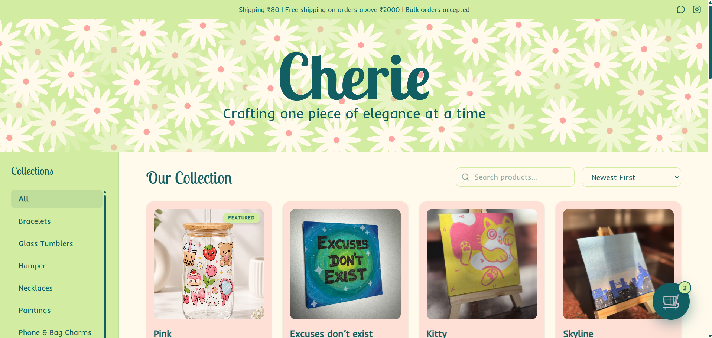
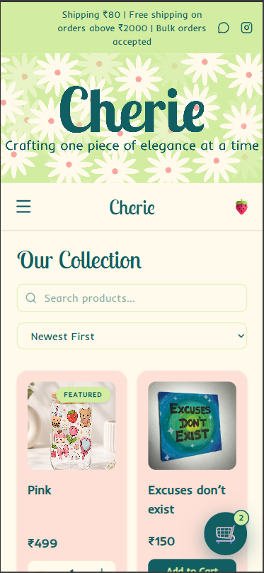
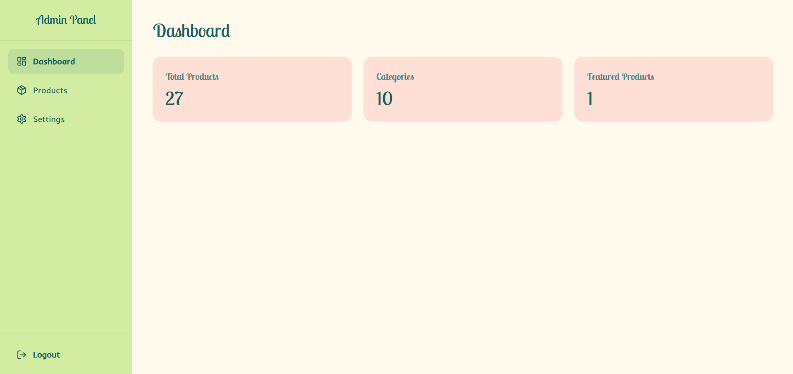

# CHERIE

A premium e-commerce platform built for a luxury jewelry and handmade crafts brand. The application includes a customer-facing storefront and a secure admin dashboard for managing products, categories, inventory, and store settings.

This is a production application currently used by the business to manage its online store and daily operations.

**🌐 Live Demo:** *https://cherie-shop.vercel.app/*

---

# Preview

> **Desktop Storefront**
>
> 

> **Mobile Storefront**
>
> 

> **Admin Dashboard**
>
> 

---

# Features

### Customer Storefront

* Browse products by category
* Product search and sorting
* Responsive shopping experience
* Interactive shopping cart
* WhatsApp order checkout
* Dynamic product listings powered by Supabase

### Admin Dashboard

* Secure authentication
* Add, edit, and delete products
* Manage categories
* Control product visibility
* Update inventory and pricing
* Manage store settings

### Real-Time Updates

* Instant synchronization between the admin dashboard and storefront using Supabase.
* Changes to products, prices, images, and inventory are reflected immediately without redeployment.

---

# Design

The UI was designed with a clean, premium aesthetic to match the brand's luxury identity.

Design considerations include:

* Mobile-first responsive layouts
* Component-based design system
* Consistent spacing and typography
* Clear visual hierarchy
* Reusable UI components
* Optimized user flows for browsing and purchasing
* Minimal and modern interface

---

# Tech Stack

### Frontend

* React 19
* TypeScript
* Vite

### Styling

* Tailwind CSS v4

### Backend

* Supabase
* Authentication
* Database
* Storage

### Routing

* React Router DOM

### Icons

* Lucide React

---

# My Role

I independently designed and developed the application from scratch, taking it from initial requirements to a production-ready product.

Responsibilities included:
- UI/UX design in Figma
- Front-end development
- Responsive implementation
- Database design and integration with Supabase
- Authentication
- Admin dashboard development
- Deployment on Vercel
- Ongoing maintenance and feature updates
---

# Challenges & Solutions

### Real-Time Store Management

Instead of hardcoding product information, I built a dynamic admin dashboard connected to Supabase. This allows products, inventory, pricing, and images to be updated instantly without requiring code changes or redeployment.

### Simplified Checkout

Rather than implementing a traditional payment gateway, I designed a WhatsApp-based checkout flow that automatically formats the customer's order, making the purchasing process simple for both customers and the business.

### Scalable Components

The application uses reusable React components, making it easier to maintain and extend as new features are added.

---

# Project Structure

```text
src/
 ├── components/
 ├── pages/
 ├── hooks/
 ├── services/
 ├── context/
 ├── assets/
 ├── lib/
 └── App.tsx
```

---

# Local Setup

Clone the repository

```bash
git clone <repository-url>
```

Install dependencies

```bash
npm install
```

Create a `.env` file in the project root

```env
VITE_SUPABASE_URL=your_supabase_url
VITE_SUPABASE_ANON_KEY=your_supabase_anon_key
```

Start the development server

```bash
npm run dev
```

---

# Deployment

The application is configured for deployment on **Vercel** as a Single Page Application (SPA).

Deployment steps:

1. Push the repository to GitHub.
2. Import the repository into Vercel.
3. Add the following environment variables:

   * `VITE_SUPABASE_URL`
   * `VITE_SUPABASE_ANON_KEY`
4. Click **Deploy**.

---

# Future Improvements

* Wishlist functionality
* Order history
* Customer accounts
* Payment gateway integration
* Product reviews and ratings
* Analytics dashboard
* Email notifications

---

# License

This project was developed as a custom solution for a client and is shared for portfolio purposes only.
